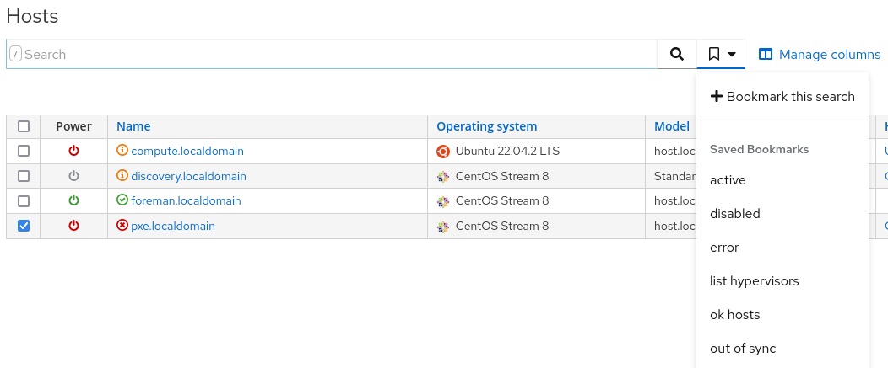
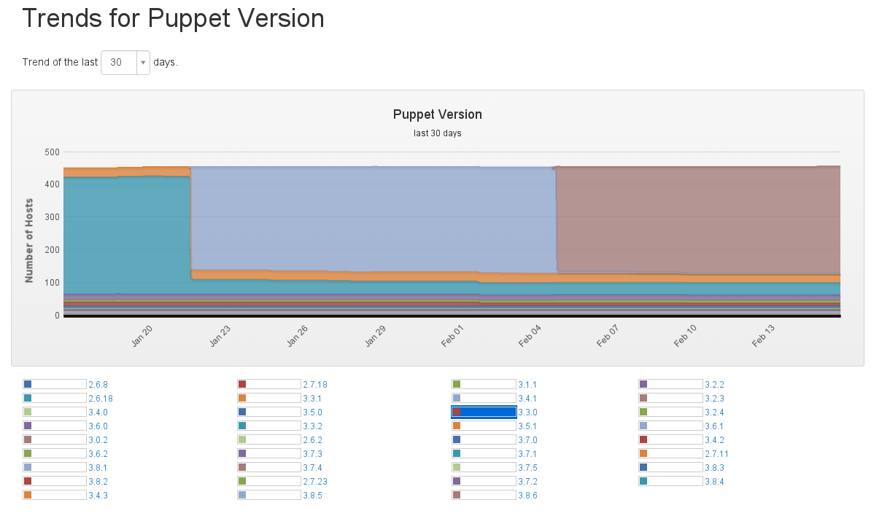

!SLIDE subsectionnonum
# WebGUI

!SLIDE smbullets small
# Searches

* Almost all views are simple lists
* Some views like "Reports" have a default filter
* Most views provide additional searches
* Bookmark and share your own search

~~~SECTION:handouts~~~

****

~~~PAGEBREAK~~~

In the Foreman WebGUI almost all views are simple unfiltered lists, some views like the "Reports" view are filtered by
default using a search and most provide additional searches to quickly filter for typically views like 'all hosts
out of sync'. But the WebGUI is not limited to these searches you can always create your own and bookmark it for later.
Setting a bookmark to public allows to share it with other users.

The search field can be used for a free text search but gets more powerful if using the autosuggestions. It provides
different comparison operators depending on the type of the field compared including SQL like wildcard matching.

For more details see: http://theforeman.org/manuals/latest/index.html#4.1.5Searching

~~~ENDSECTION~~~

!SLIDE smbullets small
# Trends

* Graphs changes in your enviroment
* Configured in the WebGUI and collected by a background task
* Internal Host parameters or Facts provided by Configuration Management
* Moved to a separate plugin with Foreman 2.2

~~~SECTION:handouts~~~

****

 
Foreman can provide graphs about changes in your environment. Those are configured and displayed in the WebGUI in
"Monitor > Trends" and collected by the background task "Trend Counter Job". By default this tasks runs every 30 minutes matching 
Puppet's default run interval because most trends will be based on the facts collected by the configuration management
solution, another source are Foreman's internal parameters like the operatingsystem of the host.

This functionality was moved to a separate plugin with Foreman 2.2 which can enabled using `foreman-installer --enable-foreman-plugin-statistics`.

~~~ENDSECTION~~~
