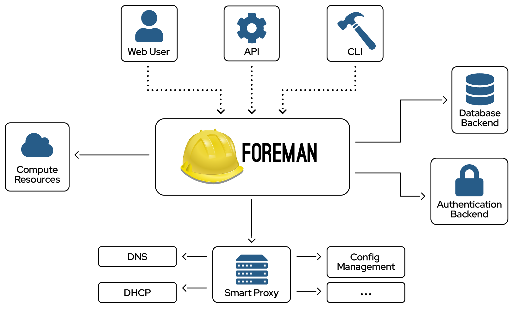

!SLIDE subsection
# ~~~SECTION:MAJOR~~~ Foreman Architecture

!SLIDE smbullets small
# Foreman Project

* Open Source Project
 * Homepage: http://theforeman.org
 * Initial release: 10 September 2009
 * Written in Ruby and Javascript
* Lifecyclemanagement for servers
 * provisioning
 * configuration
 * orchestration
 * monitoring
* Web based GUI
* Utilizes other tools via smart proxy

~~~SECTION:notes~~~

* Original authors are Paul Kelly and Ohad Levy, now working for Red Hat.
* More than 200 contributors, open bug tracker, IRC support.

~~~ENDSECTION~~~

~~~SECTION:handouts~~~

****

Foreman was originally writen by Paul Kelly and Ohad Levy and initially released on 10 September 2009.

Now it is sponsored by Red Hat who use it as base for many of their Enterprise solutions like Red Hat Network Satellite
and Red Hat OpenStack distribution.

~~~PAGEBREAK~~~

It is writen in Ruby and Javascript to provide a Web based GUI for server lifecyclemanagement, from provisioning and
configuration to orchestration and monitoring. For integration in the IT infrastructure it utilizes other tools via
its smart proxy architecture.

The project provides an open bug tracker for bug reporting and feature requests, its code on github, IRC support to 
help the community and consists of more than 200 contributors.

~~~ENDSECTION~~~

!SLIDE smbullets small noprint

# Architecture

~~~SECTION:notes~~~

* Only required Foreman, all other optional
* Next slides provide deeper information on Smart proxies and Compute resources 

~~~ENDSECTION~~~

!SLIDE smbullets small printonly

# Architecture

~~~SECTION:handouts~~~

****

Foreman provides a really flexible architecture and many optional components. Only required component is the central
Foreman installation, but depending on your needs it can manage every service required to fully automate the provisioning
process. Basicly we have two kinds of additional components Smart proxies and Compute resources.

Image copyright by the Foreman project.

~~~ENDSECTION~~~
