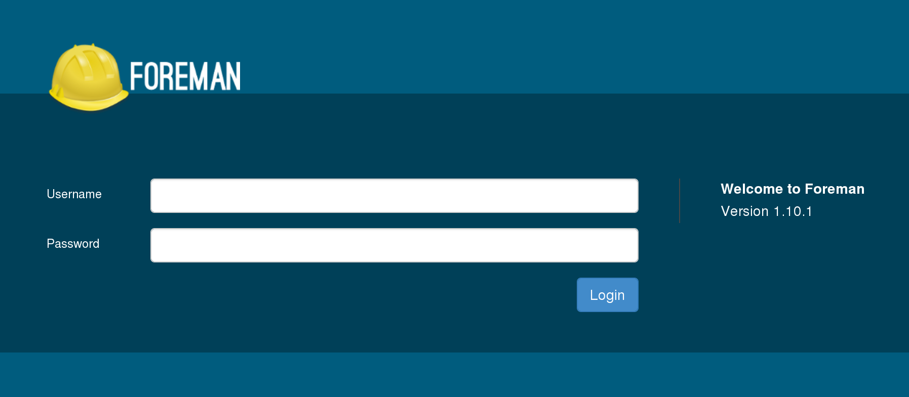

!SLIDE smbullets small
# Foreman

* Web Interface + API + CLI
* Supported platforms:
 * Server: RHEL/CentOS, Debian/Ubuntu, (Linux)
 * DB: PostgreSQL, MySQL, SQLite
 * Provisioning: RHEL/Fedora, Debian/Ubuntu, Solaris, SuSE, CoreOS, FreeBSD, Juniper Junos, Cisco NX-OS, (Windows, MacOS)
* Usermanagement:
 * Users and Groups
 * Internal / LDAP / Kerberos (via Apache Authentication)
 * Fine role based privileges

~~~SECTION:notes~~~

* Other Linux distributions are supported via source installation
* Windows and MacOS are not officially supported but reported by the community

~~~ENDSECTION~~~

~~~SECTION:handouts~~~

****

~~~PAGEBREAK~~~

Foreman provides in addition to the Web Interface an API and CLI.

It supports as platform RHEL/CentOS and Debian/Ubuntu via packages and via installation from source
also other Linux distribution. 

As database backend PostgreSQL, MySQL and SQLite are supported, while the default is PostgreSQL, 
SQLite is not recommended for productive usage.

The following operating systems are known to successfully install from Foreman:  
* RHEL/Fedora  
* Debian/Ubuntu  
* Solaris  
* SuSE  
* CoreOS  
* FreeBSD  
* Juniper Junos  
* Cisco NX-OS

Also reported by the community are:  
* Windows  
* MacOS

~~~ENDSECTION~~~

