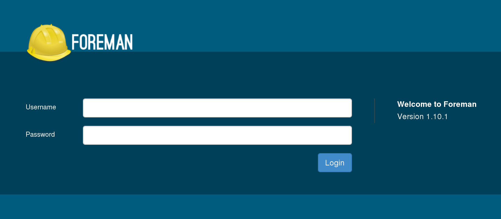

!SLIDE smbullets small noprint
# Foreman

* Web Interface + API + CLI

* Supported platforms:
 * Server: RHEL/CentOS, Debian/Ubuntu, (Linux)
 * DB: PostgreSQL
 * Provisioning: RHEL/Fedora, Debian/Ubuntu, Solaris, SUSE, CoreOS, FreeBSD, Juniper Junos, Cisco NX-OS, Windows, (macOS)
* User management:
 * Users and Groups
 * Internal / LDAP / Kerberos (via Apache Authentication) / OpenID
 * Fine role based privileges

~~~SECTION:notes~~~

* Other Linux distributions are supported via source installation
* Windows is now officially supported and documented
* macOS is not officially supported but is supported by the community

~~~ENDSECTION~~~

!SLIDE smbullets small printonly
# Foreman

* Web Interface + API + CLI
* Supported platforms:
 * Server: RHEL/CentOS, Debian/Ubuntu, (Linux)
 * DB: PostgreSQL
 * Provisioning: RHEL/Fedora, Debian/Ubuntu, Solaris, SuSE, CoreOS, FreeBSD, Juniper Junos, Cisco NX-OS, Windows, (macOS)
* Usermanagement:
 * Users and Groups
 * Internal / LDAP / Kerberos (via Apache Authentication) / OpenID
 * Fine role based privileges

~~~SECTION:handouts~~~

****

~~~PAGEBREAK~~~

Foreman provides in addition to the Web Interface an API and CLI.

For platforms, it supports RHEL/CentOS and Debian/Ubuntu via packages and via installation from source.
Installation from source is also a way for other Linux distributions as well.

As the database backend only PostgreSQL is supported to allow optimization for it. This was changed with version 2.0.

The following operating systems are known to successfully install from Foreman:

* RHEL/Fedora
* Debian/Ubuntu
* Solaris
* SuSE
* CoreOS
* FreeBSD
* Juniper Junos
* Cisco NX-OS
* Windows

Also supported by the community:

* macOS

~~~ENDSECTION~~~
