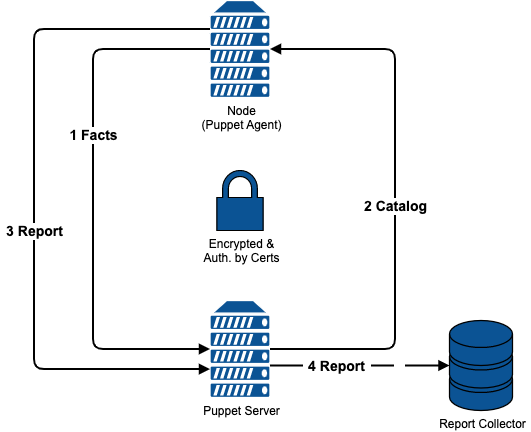

!SLIDE smbullets small
# Puppet

* Written in ruby
* Choice between Open Source or Enterprise version
 * Enterprise edition is not supported by Foreman
* Runs on Linux, Unix, Windows, …
* Describes desired state in its own declarative language

<pre>
    package { 'openssh':
      ensure => 'installed',
    }
</pre>

* Workflow
 * Manifests stored on a central server "Puppet Master"
 * Agent collects system information using facter
 * Agent contacts central server with this information
 * Master compiles catalog for agent to realize using an abstraction layer
 * Agent reports back to master
 * Master transfers reports to other tools

~~~SECTION:notes~~~

* Next slide provides a diagram of the workflow.

~~~ENDSECTION~~~

~~~SECTION:handouts~~~

****

Puppet is written in ruby and provided as a true Open Source version and as an Enterprise version with additional features and
packages with a defined software stack for easier support.

~~~PAGEBREAK~~~

Independently of the version it runs on Linux, Unix and Windows it can also configure some network devices. For configuration
it uses its own declarative language called Puppet DSL (Domain Specific Language) you can see above (example).
The desired state is described in so called manifests which are stored on one or multiple central servers. To connect the different
configuration items with the node to be configured these central servers can use an ENC (External Node Classifier). The agent runs
on the nodes and collects system information using a tool named facter before contacting the central server. The master compiles then
a catalog based on the facts provided by the agent and the manifests. This catalog is then realized by the agent using an
abstraction layer and also sends a report to the master. The master uses different handlers to send the report to other tools.

A diagram showing this workflow is provided on the next page.

~~~ENDSECTION~~~

!SLIDE smbullets small noprint
# Puppet Workflow

!SLIDE smbullets small printonly
# Puppet Workflow

~~~SECTION:handouts~~~

****

Image copyright by Puppetlabs.

~~~ENDSECTION~~~

!SLIDE smbullets small
# Foreman Puppet Integration

* Foreman -> Puppet
 * Smart proxy Puppet allows to import Puppet modules
 * Smart proxy Puppet allows to trigger agent runs
 * Smart proxy Puppet CA integrates certificate handling

* Puppet -> Foreman
 * Puppet uploads facts to Foreman
 * Puppet uses Foreman as ENC
 * Puppet transfers reports to Foreman

~~~SECTION:handouts~~~

****

Foreman integrates Puppet in several ways and also integrates itself into Puppet. Communication from the WebGUI to Puppet is handled 
using the Smart proxy for Puppet. It allows to import Puppet modules known to Puppet and to trigger Puppet agent runs using several protocols.
The Smart Proxy Puppet CA integrates certificate handling into provisioning so auto signing of the agents certificate requests during build
is allowed and also allows to manage the complete CA in the WebGUI.

~~~PAGEBREAK~~~

On the Puppet master a script is deployed which integrates Foreman as an ENC so classes selected in the WebGUI are deployed on the system.
This mechanism is also used to upload the facts provided by the agent during Puppet agent run and creating a host entry if facts are provided
for an not already existing system. Also Puppet is integrated as a reporting target to enable the web interface to show reports.

~~~ENDSECTION~~~

!SLIDE smbullets small
# Lab ~~~SECTION:MAJOR~~~.~~~SECTION:MINOR~~~: Import of Puppet classes

* Objective:
 * Make Puppet code available to Puppet and Foreman
* Steps:
 * Place Puppet modules in Puppet environment "production"
 * Import classes in Foreman
* Optional:
 * Configure Foreman to ignore specific classes

!SLIDE supplemental exercises
# Lab ~~~SECTION:MAJOR~~~.~~~SECTION:MINOR~~~: Import of Puppet classes

## Objective:

****

* Make Puppet code available to Puppet and Foreman

## Steps:

****

* Place Puppet modules found in "/home/training" on host.localdomain into "/etc/puppetlabs/code/environments/production" on foreman.localdomain
* Import the Puppet classes in Foreman using "Configure > Classes"

#### Optional:

* Configure Foreman to ignore the classes from stdlib module by creating "/usr/share/foreman/config/ignored_environments.yml"

#### Expected result:

* Class "training::user" is available in the WebGUI and can be assigned to hosts and hostgroups

!SLIDE supplemental solutions
# Lab ~~~SECTION:MAJOR~~~.~~~SECTION:MINOR~~~: Import of Puppet classes

****

## Make Puppet code available to Puppet and Foreman

****

### Place Puppet modules found in "/home/training" on host.localdomain into "/etc/puppetlabs/code/environments/production" on foreman.localdomain

     # scp -r host.localdomain:/home/training/puppetmodules.tar.gz /tmp
     # cd /etc/puppetlabs/code/environments/production
     # tar xvzf /tmp/puppetmodules.tar.gz

### Import the Puppet classes in Foreman using "Configure > Classes"

Navigate to "Configure > Classes" in the WebGUI and click on "Import from foreman.localdomain".
It will query you to select the changes you want to realize, so select the Environment "production" which should show you
classes and press "Update". If you want to do the optional step press "Cancel" instead!

### Configure Foreman to ignore the classes from stdlib module by creating "/usr/share/foreman/config/ignored_environments.yml"

Create the file "/usr/share/foreman/config/ignored_environments.yml" with the following content.

    :filters:
      - !ruby/regexp '/^stdlib.*$/'

This will ignore all classes starting with "stdlib" if you run the import like described above.

If you follow the Puppet Role Profile Pattern something like this could be helpful to ignore all internal classes.

    :filters:
      - !ruby/regexp '/^(?!role|profile).*$/'

!SLIDE smbullets small
# Parameters vs. Smart class parameters vs. Smart Variables

* Parameters
 * Simple string
 * Usable in Foreman's Provisioning Templates
 * Usable in Puppet as global parameters
 * Override by creating one of the same name in a more specific scope

* Smart class parameters
 * Available from Puppet classes
 * Different types
 * Validators
 * Override options to handle override order and behaviour

* Smart variables
 * Global parameters assigned to a Puppet class
 * Same options like Smart class parameters

* All are hideable from unprivileged users

~~~SECTION:handouts~~~

****

~~~PAGEBREAK~~~

Foreman does differentiate between three kinds of parameters.

Parameters are global parameters in a very simple fashion. Their values can only be strings and override is simply
done by creating a parameter with the same name in a more specific scope. To Puppet they are presented as a global
parameter via the ENC, in Foreman they can also be used in the Provisioning Templates.

Smart class parameters become available from imported Puppet classes and can have different types like boolean, hash
or yaml. For this types an input validator can be created to verify user input. An override behavior and order can be
defined to enable merging values depending on facts.

Smart variable provides the same options as Smart class parameters but are manually assigned to a Puppet Class and
provided to Puppet as global parameters and not class parameters.

All types have to be created on the global scope to be available in more specific scopes and all allow to hide them
from unprivileged users.

~~~ENDSECTION~~~

!SLIDE smbullets small
# Lab ~~~SECTION:MAJOR~~~.~~~SECTION:MINOR~~~: Parameterize and assign Puppet classes

* Objective:
 * Parameterize and assign Puppet classes to at least one host
* Steps:
 * Set defaults to the Smart class parameters provided by the imported class
 * Assign the Puppet class in the host menu to one host
* Optional:
 * Assign the Puppet class to another host and override the defaults

!SLIDE supplemental exercises
# Lab ~~~SECTION:MAJOR~~~.~~~SECTION:MINOR~~~: Parameterize and assign Puppet classes

## Objective:

****

* Parameterize and assign Puppet classes to at least one host

## Steps:

****

* Set defaults to the Smart class parameters provided by the imported class
* Assign the Puppet class in the host menu to one host

!SLIDE supplemental solutions
# Lab ~~~SECTION:MAJOR~~~.~~~SECTION:MINOR~~~: Parameterize and assign Puppet classes

****

## Parameterize and assign Puppet classes to at least one host

****

### Set defaults to the Smart class parameters provided by the imported class

Navigate to "Configure > Classes" and select the class "training::user". In the "Smart Class Parameter" tab
insert your name as Default Value for the id of the user, add a ssh public key as Default Value for ssh_pub_key,
for the parameter sudo select override and set the default to true.

Hint: To create a ssh key pair run "ssh-keygen". The key string required for the puppet module is the second part
of the pub file.

### Assign the Puppet class in the host menu to one host

Select one of your hosts from the "Hosts > All Hosts" view and click "Edit". In the "Puppet Classes" tab select the
class "training::user", afterwards you can see and change the parameter values in the "Parameter" tab. Press "Submit"
to save your changes.

!SLIDE smbullets small
# Lab ~~~SECTION:MAJOR~~~.~~~SECTION:MINOR~~~: Trigger Puppet agent run and inspect the report

* Objective:
 * Trigger an Puppet agent run and inspect the report
* Steps:
 * Run the Puppet agent on the host you assigned the class
 * Inspect the report of the Puppet agent run

!SLIDE supplemental exercises
# Lab ~~~SECTION:MAJOR~~~.~~~SECTION:MINOR~~~: Trigger Puppet agent run and inspect the report

## Objective:

****

* Trigger an Puppet agent run and inspect the report

## Steps:

****

* Run the Puppet agent in test mode on the host you assigned the class
* Inspect the report of the Puppet agent run

!SLIDE supplemental solutions
# Lab ~~~SECTION:MAJOR~~~.~~~SECTION:MINOR~~~: Trigger Puppet agent run and inspect the report

****

## Trigger an Puppet agent run and inspect the report

****

### Run the Puppet agent in test mode on the host you assigned the class

Login to the host you assigned the class earlier and execute the following command:

    # puppet agent -t

This will run the agent in test mode (one time in foreground with verbose output) so you will see the changes
configured in the puppet class.

### Inspect the report of the Puppet agent run

Go back to the WebGUI and navigate to the host and select "Reports". The last report should show some applied changes
and if selected it will show you the same information you saw on the console while running the agent. In addition the
meta data are visualized.

Other entry points to the reports are the dashboard showing the last reports with any events in "Latest Events" and the
Reports overview which filters by default only on the eventful reports.

!SLIDE smbullets small
# Config Groups

* Allows to group classes
* Assign like single classes

~~~SECTION:handouts~~~

****

Config Groups allow to group classes and assign them in the same way you would use single classes.
This follows the same ideas like the very popular Roles-Profiles-Pattern used in Puppet to simplify
assignment via another layer of abstraction.

~~~ENDSECTION~~~

!SLIDE smbullets small
# Triggering an Puppet agent run

* Multiple protocols available
 * Puppet kick - requires Puppet agent to listen for incoming events
 * Mcollective - requires a message queue and the Mcollective framework
 * Puppetssh - runs Puppet agent command via ssh
 * Salt - uses Salts remote execution to trigger a Puppet agent run
 * Customrun - runs whatever script you provide

* Has to be enabled via a setting

* Remote Execution plugin provides more flexibility

~~~SECTION:handouts~~~

****

The Smart proxy Puppet allows to trigger the Puppet run we manually triggered in the last exercise from the WebGUI.
For this we enable it by setting the option "Puppetrun" to true and configure the Smart Proxy to use one of the mentioned
providers, but all of them will also require some configuration on the agent side.

The Foreman plugin Remote Execution is more flexible and also handles the agent configuration but only provides SSH for now.
We will have a deeper look into this instead of configuring the "Puppetrun" feature.

~~~ENDSECTION~~~

!SLIDE smbullets small
# Managing Foreman with Puppet

* Puppet modules provided by Foreman Project
 * Already utilized by Foreman Installer
 * Compatible with all supported platforms
 * Version compatibility to observe
* Configuration of:
 * Foreman
 * Smart Proxy
 * Puppet
 * Depending and managed services

~~~SECTION:notes~~~

* Show the students "puppet module list --modulepath=/usr/share/foreman-installer/modules" for a list of the modules

~~~ENDSECTION~~~

~~~SECTION:handouts~~~

****

It is also possible to manage Foreman and/or its Smart Proxies using Puppet. The modules to do so are provided by the
Foreman Project itself and are already used in the Foreman Installer. The modules are written to be compatible with
all supported platforms. For compatibility of the modules with the Foreman or Smart Proxy version observe the notes
in the README. File.

The modules provided can configure Foreman, the Smart Proxy and Puppet in the way it is required by Foreman and the services
required to run Foreman or managed by the Smart Proxy.

~~~ENDSECTION~~~

!SLIDE smbullets small
# Utilizing Foreman within Puppet

* Function to query the API
 * Alternative to exported resources and PuppetDB query
 * Login data and query as hash
 * Returns hash

<pre>
$foreman = foreman({ item => 'hosts',
                     search => 'status.failed = 0',
                     per_page => 1000,
                     foreman_url => 'https://foreman.localdomain',
                     foreman_user => 'admin',
                     foreman_pass => 'PASSWORD' })
</pre>

~~~SECTION:handouts~~~

****

The Puppet module "foreman" provided by the Foreman project includes a function to query the Foreman API in a puppet class.
This is an alternative for exported resources or a PuppetDB query. It takes a hash with the login data and the query and returns
a result hash including an array of hashes describing the hosts. 

The hash is best used with a defined resource and create_resource function or within a template.

Next release of the function will also allow to provide a filter for reducing the data for easier handling.

~~~ENDSECTION~~~
