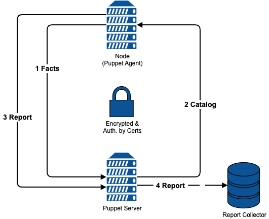

!SLIDE smbullets small noprint
# Puppet / OpenVox

* Written in Ruby
* Choice between:
 * OpenVox - true Open Source Fork
 * Puppet Open Source - no longer maintained
 * Puppet Core - not Open Source, so cannot be tested by Foreman
 * Puppet Enterprise edition is not supported by Foreman
* Runs on Linux, Unix, Windows, …
* Describes desired state in its own declarative language

<pre>
    package { 'openssh':
      ensure => 'installed',
    }
</pre>

!SLIDE smbullets small noprint
# Puppet Workflow

* Manifests stored on a central Puppet / OpenVox Server
* Agent collects system information using facter
* Agent contacts central server with this information
* Server compiles catalog for agent to realize using an abstraction layer
* Agent reports back to server
* Server transfers reports to other tools

~~~SECTION:notes~~~

* Next slide provides a diagram of the workflow.

~~~ENDSECTION~~~

!SLIDE smbullets small printonly
# Puppet

* Written in Ruby
* Choice between:
 * OpenVox - true Open Source Fork
 * Puppet Open Source - no longer maintained
 * Puppet Core - not Open Source, so cannot be tested by Foreman
 * Puppet Enterprise edition is not supported by Foreman
* Runs on Linux, Unix, Windows, …
* Describes desired state in its own declarative language

<pre>
    package { 'openssh':
      ensure => 'installed',
    }
</pre>

* Workflow
 * Manifests stored on a central Puppet Server
 * Agent collects system information using facter
 * Agent contacts central server with this information
 * Server compiles catalog for agent to realize using an abstraction layer
 * Agent reports back to server
 * Puppet Server transfers reports to other tools

~~~SECTION:handouts~~~

****

~~~PAGEBREAK~~~

Puppet / OpenVox is written in Ruby. Puppet is no longer provided as a true Open Source version, so this version is still available but unmaintained.
Puppet Core is a hardened version you can access by signing a restrictive EULA and the Enterprise version adds additional features and packages, but both versions cannot be tested and supported by Foreman.
OpenVox is a true Open Source fork of Puppet, maintained by the community and backed by several companies.

Independent of the version it runs on Linux, Unix and Windows. It can also configure some network devices. For configuration
it uses its own declarative language called Puppet DSL (Domain Specific Language) you can see above (example).
The desired state is described in so called manifests which are stored on one or multiple central servers. To connect the different
configuration items with the node to be configured these central servers can use an ENC (External Node Classifier). The agent runs
on the nodes and collects system information using a tool named facter before contacting the central server. The server then compiles
a catalog based on the facts provided by the agent and the manifests. This catalog is then realized by the agent using an
abstraction layer and also sends a report to the server. The server uses different handlers to send the report to other tools.

A diagram showing this workflow is provided on the next page.

~~~ENDSECTION~~~

!SLIDE smbullets small noprint
# Puppet Workflow

!SLIDE smbullets small printonly
# Puppet Workflow

!SLIDE smbullets small
# Foreman Puppet Integration

* Foreman -> Puppet
 * Smart Proxy Puppet allows to import Puppet modules
 * Smart Proxy Puppet allows to trigger agent runs
 * Smart Proxy Puppet CA integrates certificate handling

* Puppet -> Foreman
 * Puppet uploads facts to Foreman
 * Puppet uses Foreman as ENC
 * Puppet transfers reports to Foreman

~~~SECTION:handouts~~~

****

Foreman integrates Puppet in several ways and also integrates itself into Puppet. Communication from the WebGUI to Puppet is handled
using the Smart Proxy for Puppet. It allows to import Puppet modules known to Puppet and to trigger Puppet agent runs using several protocols.
The Smart Proxy Puppet CA integrates certificate handling into provisioning, so auto signing of the agents' certificate requests during build
is allowed and also allows to manage the complete CA in the WebGUI.

On the Puppet master a script is deployed which integrates Foreman as an ENC, so classes selected in the WebGUI are deployed on the system.
This mechanism is also used to upload the facts provided by the agent during Puppet agent run and creating a host entry if facts are provided
for a not already existing system. Also, Foreman is integrated as a reporting target to enable the web interface to show reports.

~~~ENDSECTION~~~

!SLIDE smbullets small
# Lab ~~~SECTION:MAJOR~~~.~~~SECTION:MINOR~~~: Import of Puppet classes

* Objective:
 * Make Puppet code available to Puppet and Foreman
* Steps:
 * Enable Puppet and install the Foreman and Smart Proxy plugins to integrate it
 * Place Puppet modules in Puppet environment "production"
 * Import classes in Foreman
* Optional:
 * Configure Foreman to ignore specific classes

!SLIDE supplemental exercises
# Lab ~~~SECTION:MAJOR~~~.~~~SECTION:MINOR~~~: Import of Puppet classes

## Objective:

****

* Make Puppet code available to Puppet and Foreman

## Steps:

****

* Enable Puppet and install the Foreman and Smart Proxy plugins to integrate it
* Place Puppet modules found in "/home/training" on host.localdomain into "/etc/puppetlabs/code/environments/production" on foreman.localdomain
* Import the Puppet classes in Foreman using "Configure > Puppet ENC > Classes"

#### Optional:

* Configure Foreman to ignore the classes from stdlib module by creating "/usr/share/foreman/config/ignored_environments.yml"

#### Expected result:

* Class "training::user" is available in the WebGUI and can be assigned to hosts and hostgroups

!SLIDE supplemental solutions
# Lab ~~~SECTION:MAJOR~~~.~~~SECTION:MINOR~~~: Import of Puppet classes

****

## Make Puppet code available to Puppet and Foreman

****

### Enable Puppet and install the Foreman and Smart Proxy plugins to integrate it

All this can be done using the Foreman installer, but as Katello's certificates need to be used we need to give also these parameters.

    # foreman-installer --enable-foreman-plugin-puppet \
    --foreman-proxy-puppet true \
    --foreman-proxy-puppetca true \
    --enable-puppet \
    --puppet-server true \
    --puppet-server-foreman-ssl-ca /etc/pki/katello/puppet/puppet_client_ca.crt \
    --puppet-server-foreman-ssl-cert /etc/pki/katello/puppet/puppet_client.crt \
    --puppet-server-foreman-ssl-key /etc/pki/katello/puppet/puppet_client.key

### Place Puppet modules found in "/home/training" on host.localdomain into "/etc/puppetlabs/code/environments/production" on foreman.localdomain

     # scp -r host.localdomain:/home/training/puppetmodules.tar.gz /tmp
     # cd /etc/puppetlabs/code/environments/production/modules
     # tar xvzf /tmp/puppetmodules.tar.gz

### Import the Puppet classes in Foreman using "Configure > Puppet ENC > Classes"

Navigate to "Configure > Puppet ENC > Classes" in the WebGUI and click on "Import from foreman.localdomain".
It will ask you to select the changes you want to realize, so select the Environment "production" which should show you
classes and press "Update". If you want to do the optional step, press "Cancel" instead!

### Configure Foreman to ignore the classes from stdlib module by creating "/usr/share/foreman/config/ignored_environments.yml"

Create the file "/usr/share/foreman/config/ignored_environments.yml" with the following content.

    :filters:
      - !ruby/regexp '/^stdlib.*$/'

This will ignore all classes starting with "stdlib" if you run the import like described above.

If you follow the Puppet Role Profile Pattern, something like this could be helpful to ignore all internal classes.

    :filters:
      - !ruby/regexp '/^(?!role|profile).*$/'

!SLIDE smbullets small
# Parameters vs. Smart class parameters

* Parameters
 * Different types since 1.22
 * Usable in Foreman's Provisioning Templates
 * Usable in Puppet as global parameters
 * Override by creating one of the same name in a more specific scope
* Smart class parameters
 * Available from Puppet classes
 * Different types
 * Validators
 * Override options to handle override order and behaviour
* All are hideable from unprivileged users

~~~SECTION:handouts~~~

****

Foreman does differentiate between two kinds of parameters.

Parameters are global parameters in a very simple fashion. Their values can be of different types since 1.22, before that
they could only be strings. Overriding is simply done by creating a parameter with the same name in a more specific scope.
To Puppet they are presented as a global parameter via the ENC, in Foreman they can also be used in the Provisioning Templates.

Smart class parameters become available from imported Puppet classes and can have different types like boolean, hash
or yaml. For these types an input validator can be created to verify user input. An override behavior and order can be
defined to enable merging values depending on facts.

~~~PAGEBREAK~~~

Smart variables were a third type, meant for older Puppet versions and are now removed.

All types have to be created on the global scope to be available in more specific scopes and all allow to hide them
from unprivileged users.

~~~ENDSECTION~~~

!SLIDE smbullets small
# Lab ~~~SECTION:MAJOR~~~.~~~SECTION:MINOR~~~: Parameterize and assign Puppet classes

* Objective:
 * Parameterize and assign Puppet classes to at least one host
* Steps:
 * Set defaults to the Smart class parameters provided by the imported class
 * Assign the Puppet class in the host menu to one host
* Optional:
 * Assign the Puppet class to another host and override the defaults

!SLIDE supplemental exercises
# Lab ~~~SECTION:MAJOR~~~.~~~SECTION:MINOR~~~: Parameterize and assign Puppet classes

## Objective:

****

* Parameterize and assign Puppet classes to at least one host

## Steps:

****

* Set defaults to the Smart class parameters provided by the imported class
* Assign the Puppet class in the host menu to one host

!SLIDE supplemental solutions
# Lab ~~~SECTION:MAJOR~~~.~~~SECTION:MINOR~~~: Parameterize and assign Puppet classes

****

## Parameterize and assign Puppet classes to at least one host

****

### Set defaults to the Smart class parameters provided by the imported class

Navigate to "Configure > Puppet ENC > Classes" and select the class "training::user". In the "Smart Class Parameter" tab
insert your name as Default Value for the id of the user, add a ssh public key as Default Value for ssh_pub_key,
for the parameter sudo set the parameter type to boolean and the default to true.
All this requires you to check the box next to Override!

Hint: To create a ssh key pair run "ssh-keygen". The key string required for the Puppet module is the second part
of the pub file.

### Assign the Puppet class in the host menu to one host

Select one of your hosts from the "Hosts > All Hosts" view and click "Edit".
On the "Host" tab select the production environment and your server as Puppet and Puppet CA Proxy.
On the "Puppet ENC" tab select the class "training::user", afterwards you can see and change the parameter values in the "Parameter" tab.
Press "Submit" to save your changes.

!SLIDE smbullets small
# Lab ~~~SECTION:MAJOR~~~.~~~SECTION:MINOR~~~: Trigger Puppet agent run and inspect the report

* Objective:
 * Trigger an Puppet agent run and inspect the report
* Steps:
 * Run the Puppet agent on the host you assigned the class
 * Inspect the report of the Puppet agent run

!SLIDE supplemental exercises
# Lab ~~~SECTION:MAJOR~~~.~~~SECTION:MINOR~~~: Trigger Puppet agent run and inspect the report

## Objective:

****

* Trigger an Puppet agent run and inspect the report

## Steps:

****

* Run the Puppet agent in test mode on the host you assigned the class
* Inspect the report of the Puppet agent run

!SLIDE supplemental solutions
# Lab ~~~SECTION:MAJOR~~~.~~~SECTION:MINOR~~~: Trigger Puppet agent run and inspect the report

****

## Trigger an Puppet agent run and inspect the report

****

### Run the Puppet agent in test mode on the host you assigned the class

Login to the host you assigned the class earlier and execute the following command:

    # puppet agent -t

This will run the agent in test mode (one time in foreground with verbose output) so you will see the changes
configured in the Puppet class.

An alternative would be to use "Run Puppet Once" on the host view to utilizie Remote Execution.

### Inspect the report of the Puppet agent run

Go back to the WebGUI and navigate to the host and select "Reports". The last report should show some applied changes
and if selected it will show you the same information you saw on the console while running the agent. In addition the
meta data are visualized.

Other entry points to the reports are the dashboard showing the last reports with any events in "Latest Events" and the
Reports overview which by default only filters on the eventful reports.

!SLIDE smbullets small
# Config Groups

* Allows to group classes
* Assign like single classes

~~~SECTION:handouts~~~

****

Config Groups allow to group classes and assign them in the same way you would use single classes.
This follows the same ideas like the very popular Roles-Profiles-Pattern used in Puppet to simplify
assignment via another layer of abstraction.

~~~ENDSECTION~~~

!SLIDE smbullets small
# Managing Foreman with Puppet

* Puppet modules provided by Foreman Project
 * Already utilized by Foreman Installer
 * Compatible with all supported platforms
 * Version compatibility to observe
* Configuration of:
 * Foreman
 * Smart Proxy
 * Puppet
 * Depending and managed services

~~~SECTION:notes~~~

* Show the students "puppet module list --modulepath=/usr/share/foreman-installer/modules" for a list of the modules

~~~ENDSECTION~~~

~~~SECTION:handouts~~~

****

It is also possible to manage Foreman and/or its Smart Proxies using Puppet. The modules to do so are provided by the
Foreman Project itself and are already used in the Foreman Installer. The modules are written to be compatible with
all supported platforms. For compatibility of the modules with the Foreman or Smart Proxy version observe the notes
in the README file.

The modules provided can configure Foreman, the Smart Proxy and Puppet in the way it is required by Foreman and the services
required to run Foreman or managed by the Smart Proxy.

~~~ENDSECTION~~~

!SLIDE smbullets small
# Utilizing Foreman within Puppet

* Function to query the API
 * Alternative to exported resources and PuppetDB query
 * Login data and query as hash
 * Returns hash
 * Filter can reduce the data

<pre>
$hosts = foreman('hosts',
                 'hostgroup=Grid',
                 '20',
                 'https://foreman.localdomain',
                 'my_api_foreman_user',
                 'my_api_foreman_pass')
</pre>

~~~SECTION:handouts~~~

****

The Puppet module "foreman" provided by the Foreman project includes a function to query the Foreman API in a Puppet class.
This is an alternative for exported resources or a PuppetDB query. It takes the login data and the query options and returns
a result hash including an array of hashes describing the hosts.
The hash is best used with a defined resource and create_resource function or within a template.
Latest release of the function allow to provide a filter for reducing the data for easier handling.

~~~ENDSECTION~~~

!SLIDE smbullets small
# Integration of OpenBolt

* OpenBolt is the orchestration solution of Puppet
 * Written in Ruby
 * Tasks use Puppet DSL
 * Tasks are part of Puppet modules
* Integration allows to run Tasks
 * Foreman plugin provides the UI
 * Smart Proxy plugin run the task
 * Tasks are executed via ssh or winrm on hosts

~~~SECTION:handouts~~~

****

OpenBolt (the Open Source version provided by OpenVox) or Bolt (the version by Puppet) adds orchestration to the Puppet world.
It is written in Ruby and runs tasks which use Puppet DSL and are distributed as part of Puppet modules

The integration with Foreman allows to run tasks. The UI for this is provided as a Foreman plugin which requires at least one Smart proxy with the plugin installed.
The Smart proxy runs the task which is then executed via ssh or winrm on hosts, support for choria is on the todo list.

~~~ENDSECTION~~~

!SLIDE smbullets small
# Lab ~~~SECTION:MAJOR~~~.~~~SECTION:MINOR~~~: Run tasks using OpenBolt

* Objective:
 * Install the OpenBolt integration to run tasks on your systems
* Steps:
 * Install OpenBolt
 * Install the Foreman and Smart Proxy plugins to integrate it
 * Configure it to use the already existing setup from Remote Execution
 * Run a task

!SLIDE supplemental exercises
# Lab ~~~SECTION:MAJOR~~~.~~~SECTION:MINOR~~~: Run tasks using OpenBolt

## Objective:

****

* Install the OpenBolt integration to run tasks on your systems

## Steps:

****

* Install OpenBolt provided by the OpenVox repository as package
* Install the Foreman and Smart Proxy plugins to integrate it
* Configure it to use the already existing setup from Remote Execution via global settings
* Run a task included in the OpenBolt package

!SLIDE supplemental solutions
# Lab ~~~SECTION:MAJOR~~~.~~~SECTION:MINOR~~~: Run tasks using OpenBolt

****

## Install the OpenBolt integration to run tasks on your systems

****

### Install OpenBolt

The package `openbolt` provided by the OpenVox repository is not installed by the Foreman Installer, so a manual installation is required.

    # dnf install -y openbolt

### Install the Foreman and Smart Proxy plugins to integrate it

The plugin installation is similar to what we already did with other integrations.

    # foreman-installer --enable-foreman-plugin-openbolt \
    --enable-foreman-proxy-plugin-openbolt

### Configure it to use the already existing setup from Remote Execution

Navigate to "Administration > Settings", on the newly added tab "OpenBolt" set "User" and "SSH Private Key" like it is used by Remote Execution.
By default "root" is used as user and the private key stored in "/usr/share/foreman-proxy/.ssh/id_rsa_foreman_proxy" for the SSH authentication.
This will allow you to run tasks on all the systems you prepared for Remote Execution already.

### Run a task

Navigate to "OpenBolt > Launch Task" and select your Smart proxy "foreman.localdomain", one or more hosts to run the task on and the task "package".
The task allows to set some parameters. The allowed values and a description is provided when opening the parameter details.
Set the action to "install" and the name to "vim-enhanced".
With the settings already containing all the options needed, just press "Launch Task" in the top right corner.

You should see now the task being executed and after some second a success message with details.
If some error message is shown, verify your connection settings.
