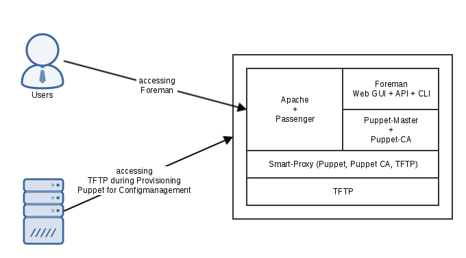
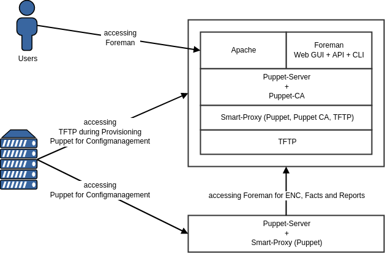
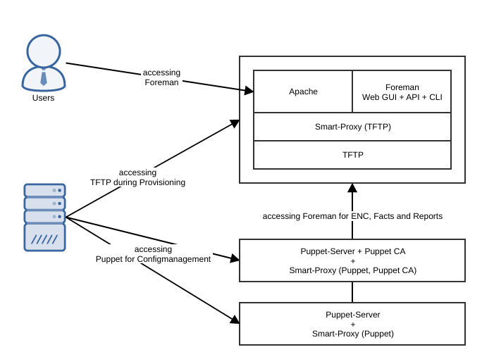
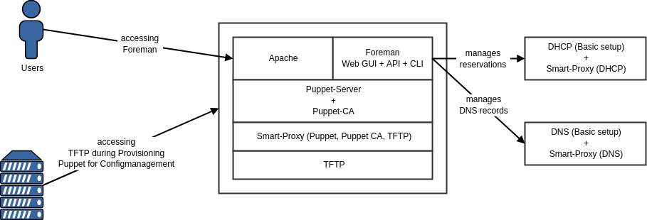
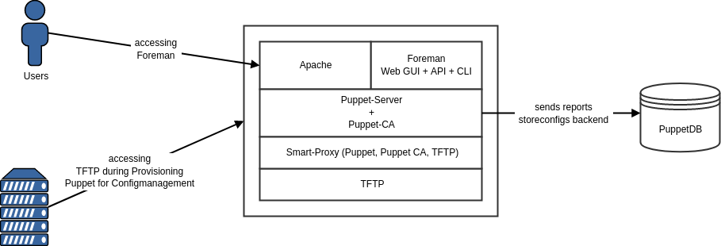

!SLIDE smbullets small
# Scenarios

* All-in-one
* All-in-one with additional Puppet servers
* Separate Puppet servers
* Smart proxies
* Integration of PuppetDB

~~~SECTION:handouts~~~

****

The Foreman installer allows to setup different scenarios depending on its parameters or answers in interactive mode.
All the scenarios above are explained in the course material, commands required can be found in the Foreman manual on
the project homepage. For the training we will stick to the default all-in-one setup and add additional Smart proxies.

~~~ENDSECTION~~~

!SLIDE smbullets small noprint
# All-in-one

* Default setup on unparameterized run only for Configuration Management
* Add at least Smart Proxy TFTP for Provisioning

* Expandable with additional plugins and Smart proxies

~~~SECTION:notes~~~

* Plugins can be added simply as parameter during installation or later on
* Smart proxies are covered later because it is the same procedure for installation on Foreman host or others

~~~ENDSECTION~~~

!SLIDE smbullets small printonly
# All-in-one

* Default setup on unparameterized run only for Configuration Management
* Add at least Smart Proxy TFTP for Provisioning

* Expandable with additional plugins and Smart proxies

~~~SECTION:handouts~~~

****

~~~PAGEBREAK~~~

The Foreman installer by default installs an all-in-one scenario with Apache httpd and Puma
serving the Foreman Web GUI and API and the Puppet server including the certificate authority.
In addition it installs and configures the Smart Proxy covering the installed components
Puppet and  Puppet CA so it can work as UI for Puppet. 

In addition it makes to prepare TFTP or another way of Provisioning.

Additional plugins including Compute Resources could be enabled setting the corresponding parameter
to true. Smart Proxies can also be added to the system hosting Foreman or on different machines which
will be covered later.

~~~ENDSECTION~~~

!SLIDE smbullets small noprint
# All-in-one with additional Puppet servers

* Default setup on Foreman host
* Precreate certificates on Puppet CA
* Run installer with parameters to disable Foreman on additional Puppet servers

~~~SECTION:notes~~~

* Preferred scenario for growing the Infrastructure and making Puppet server high available.
* But all Puppet server depend on Foreman so place it on a high available machine.

~~~ENDSECTION~~~

!SLIDE smbullets small printonly
# All-in-one with additional Puppet servers

* Default setup on Foreman host
* Precreate certificates on Puppet CA
* Run installer with parameters to disable Foreman on additional Puppet servers

~~~SECTION:handouts~~~

****

For the Foreman host run the same setup like before afterwards create certificates for the
Puppet servers to be added. If you do not do so, it will create an additional CA on this
systems. Last run the Foreman installer on the systems with parameters to disable Foreman
and the Puppet CA.
Depending on your infrastructure there are different ways to balance the load on the Puppet
servers:

* Manual point servers to a Puppet server
* Use Round-robin DNS which requires your Puppet server certificates to be created with an 
DNS alias
* Use a Loadbalancer solution which depending on SSL handling also requires DNS aliases
* Utilize DNS SRV records which requires Puppet 3 or higher and appropriate agent configuration

~~~ENDSECTION~~~

!SLIDE smbullets small noprint
# Separate Puppet servers

* Setup on Foreman host with Puppet server and Smart Proxies disabled
* Run installer with parameters to disable Foreman on separate Puppet servers

~~~SECTION:notes~~~

* Same as the scenario before but removes load created by Puppet server from the Foreman server

~~~ENDSECTION~~~

!SLIDE smbullets small printonly
# Separate Puppet servers

* Setup on Foreman host with Puppet server and Smart Proxies disabled
* Run installer with parameters to disable Foreman on separate Puppet servers

~~~SECTION:handouts~~~

****

~~~PAGEBREAK~~~

This is nearly the same setup as before but removes the load created by being a Puppet server
from the Foreman server. You still have to remember to create only the first Puppet server as a
certificate authority and setup a solution to load balance the agents.

~~~ENDSECTION~~~

!SLIDE smbullets small noprint
# Smart Proxies

* Foreman installer helps to setup Smart Proxies

~~~SECTION:notes~~~

* Smart Proxies can also be added to the All-in-one Foreman host - we will do so in the Training
* Requires certificate for communication and OAuth provided in the settings of Foreman.

~~~ENDSECTION~~~

!SLIDE smbullets small printonly
# Smart Proxies

* Foreman installer helps to setup Smart Proxies

~~~SECTION:handouts~~~

****

The Foreman installer can install a Smart Proxy and register it automatically to the Foreman instance.
This could be done on the Foreman host itself or any other host communication is possible.
This will require the certificate to be created in advance to allow the communication. For authentication
it uses OAuth provided by Foreman available to the administrators.

~~~PAGEBREAK~~~

It also can install and configure the corresponding service like Bind for DNS, ISC DHCP or TFTP but this
is a very basic setup and will typically require some additional configuration.

After the Smart proxy is registered to Foreman import of configured data like subnets or manual configuration
is required.

~~~ENDSECTION~~~

!SLIDE smbullets small noprint
# Integration of PuppetDB

* Foreman installer helps to integrate PuppetDB

~~~SECTION:notes~~~

* Integration of existing PuppetDB, no installation!

~~~ENDSECTION~~~

!SLIDE smbullets small printonly
# Integration of PuppetDB

* Foreman installer helps to integrate PuppetDB

~~~SECTION:handouts~~~
****
The Foreman installer allows to add PuppetDB as reporting target and storeconfigs backend
to the Puppet servers. It does not setup PuppetDB server! 
PuppetDB is not required in a typical setup with Foreman. Instead of using storeconfigs
or PuppetDB queries Foreman's own database could also be used for queries. The required
function is part of the Puppet module "foreman" provided by the Foreman Project.

Installation of PuppetDB if required for your setup could easily be done with the Puppet
module "puppetdb" provided by Puppetlabs.

~~~ENDSECTION~~~

