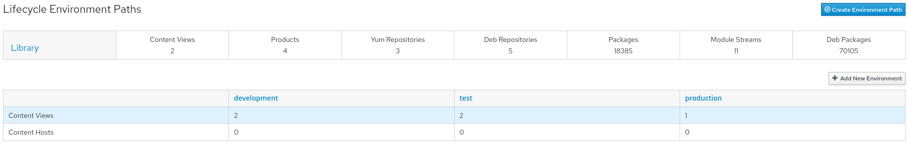
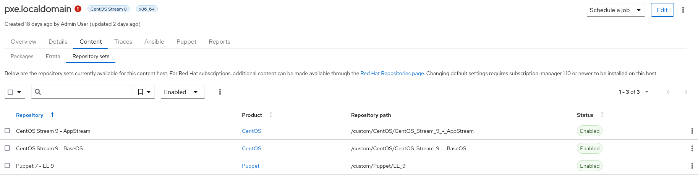

!SLIDE smbullets small noprint
# Content management - Products

* Content management is based on products
* Products consists of one or more repositories of any content type

!SLIDE smbullets small printonly
# Content management - Products

* Content management is based on products
* Products consists of one or more repositories of any content type

~~~SECTION:handouts~~~

****

In Katello the Content management is based on products which consist of one or more repositories of
any content type. For packages different sync options are available in Katello >= 3.0 which allow to
sync packages also only on demand.

~~~PAGEBREAK~~~

This allows different configurations depending on your focus. For example you can create a product
named after the operatingsystem you run and add all repositories you require and have a second product
named Puppet containing all Puppet modules in use. Or you can create a product named after your application
containing all repositories for every operatingsystem you use and one for the puppet module to manage the
application itself.

~~~ENDSECTION~~~

!SLIDE smbullets small noprint
# Content management - Content Views

* Content Views create versioned snapshots of one or more repositories
* Allow to filter several software packages
* Composite Content Views are possible

!SLIDE smbullets small printonly
# Content management - Content Views

* Content Views create versioned snapshots of one or more repositories
* Allow to filter several software packages
* Composite Content Views are possible

~~~SECTION:handouts~~~

****

A Content View allows to create a versioned snapshot of one or more repositories and if required to filter
specific packages or problematic versions of a package. New versions of a content view can be published
afterwards and be promoted to a Lifecyle Environment.

~~~PAGEBREAK~~~

Incremental updates allow to push a security hotfix or something similar directly to all snapshots.

Composite Content Views are possible to combine existing Content Views in one.

~~~ENDSECTION~~~

!SLIDE smbullets small noprint
# Content management - Lifecycle Environments

* Lifecycle Environments represent different stages
* Multiple Lifecycle Environments Paths allow different staging models

!SLIDE smbullets small printonly
# Content management - Lifecycle Environments

* Lifecycle Environments represent different stages
* Multiple Lifecycle Environments Paths allow for different staging models

~~~SECTION:handouts~~~

****

Lifecycle Environments represent different stages and are connected to a path which only allows to promote
a Content View to a stage after it has hit all stages before on the path and of course was tested there
successfully.

You can create multiple Lifecycle Environments Paths to allow different staging models representing
different workflows of projects or departments.

~~~ENDSECTION~~~

!SLIDE smbullets small noprint
# Content management - Content Hosts

* Consumer of content and subscriptions - different view on a host than Hosts in Foreman
* Optional Agent allows to execute commands

!SLIDE smbullets small printonly
# Content management - Content Hosts

* Consumer of content and subscriptions - different view on a host than Hosts in Foreman
* Optional Agent allows to execute commands

~~~SECTION:handouts~~~

****

The Content Host is a different view on the host representing it as consumer of content and subscriptions
for Katello. The Host in Foreman is used for provisioning and configuration management. A host is always
represented as both starting with the ongoing process to unify the views starting with Katello 3.0.

An optional agent allows to execute commands issued in the WebGUI on the host like installing a package or updating
all packages. A chat is used for this feature allowing for just in time execution.

By creating an Activation Key and using it to register a Content Host setting defaults like consumed products is
possible.

~~~ENDSECTION~~~

