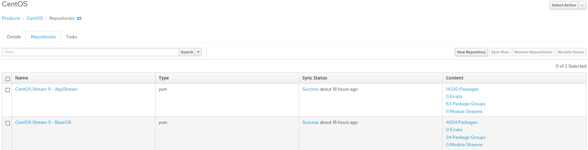

!SLIDE smbullets small noprint
# Content management - Products

* Content management is based on products
* Products consists of one or more repositories of any content type

!SLIDE smbullets small printonly
# Content management - Products

* Content management is based on products
* Products consists of one or more repositories of any content type

~~~SECTION:handouts~~~

****

In Katello the Content management is based on products which consist of one or more repositories of
any content type. For packages different sync options are available which allow to sync packages also only on demand.

This allows to separate repository by vendor and having different sync plans based on their release policy
while having all the provided content in one place, RPM, DEB, Container images, ...

~~~ENDSECTION~~~

!SLIDE smbullets small noprint
# Content management - Lifecycle Environments

* Lifecycle Environments represent different stages
* Multiple Lifecycle Environments Paths allow different staging models

!SLIDE smbullets small printonly
# Content management - Lifecycle Environments

* Lifecycle Environments represent different stages
* Multiple Lifecycle Environments Paths allow for different staging models

~~~SECTION:handouts~~~

****

Lifecycle Environments represent different stages and are connected to a path which only allows to promote
a Content View to a stage after it has hit all stages before on the path and of course was tested there
successfully.

You can create multiple Lifecycle Environments Paths to allow different staging models representing
different workflows of projects or departments.

~~~ENDSECTION~~~

!SLIDE smbullets small noprint
# Content management - Content Views

* Content Views create versioned snapshots of one or more repositories
* Allow to filter several software packages
* Incremental Content Views provide faster workflow for security fixes
* Composite Content Views are possible

!SLIDE smbullets small printonly
# Content management - Content Views

* Content Views create versioned snapshots of one or more repositories
* Allow to filter several software packages
* Incremental Content Views provide faster workflow for security fixes
* Composite Content Views are possible

~~~SECTION:handouts~~~

****

A Content View allows to create a versioned snapshot of one or more repositories and if required to filter
specific packages or problematic versions of a package. New versions of a content view can be published
afterwards and be promoted to a Lifecyle Environment.

Incremental updates allow to push a security hotfix or something similar directly to all snapshots.

Composite Content Views are possible to combine existing Content Views in one.
This can become handy for applications were a server needs to be always upgraded first.

~~~ENDSECTION~~~

!SLIDE smbullets small noprint
# Content management - Content Hosts

* Consumer of content and subscriptions 
 * different view on a host than Hosts in Foreman
 * ongoing work to integrate this completely
* Remote Execution allows to execute commands
* Client tools report installed packages and required restarts

!SLIDE smbullets small printonly
# Content management - Content Hosts

* Consumer of content and subscriptions 
 * different view on a host than Hosts in Foreman
 * ongoing work to integrate this completely
* Remote Execution allows to execute commands
* Client tools report installed packages and required restarts

~~~SECTION:handouts~~~

****

~~~PAGEBREAK~~~

The Content Host is a different view on the host representing it as consumer of content and subscriptions
for Katello. The Host in Foreman is used for provisioning and configuration management. A host is always
represented as both starting with the ongoing process to unify the views starting with Katello 3.0.
Ongoing work has already integrated most of this to the normal host view leaving content host as an alternative, historical entrypoint.

Remote Execution allows to execute commands issued in the WebGUI on the host like installing a package or updating
all packages. The client tools will then report back the installed packages and required restarts of a service or the system.

By creating an Activation Key and using it to register a Content Host setting defaults like consumed products is
possible.

~~~ENDSECTION~~~

