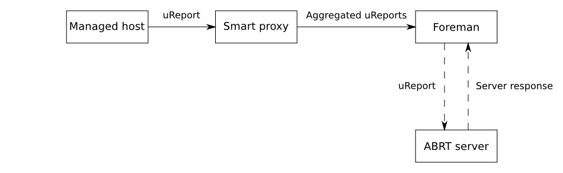

!SLIDE smbullets small
# ABRT

* Automatic Bug Reporting Tool
* Available on RHEL, CentOS, Fedora, OpenSuSE, Mandriva
* Collects crash dumps
* Forwards them to a retracing server

* _Use case:_ 
 * Get detailed crash reports from your systems
 * Forward crash reports for easier bug analyses

~~~SECTION:handouts~~~

****

The Automatic Bug Reporting Tool is per default installed on Fedora and RHEL derivates and also available
for OpenSuSE and Mandriva to automatically open bug reports on their bug trackers to provide a crash dump
for easier bug analyses. The retracing server allows for grouping and prioritizing.

With the Foreman Plugin ABRT you can collect those crash dumps on the Foreman host instead of directly 
forwarding them to the internet. It also allows to forward them automatically to the upstream retracing
server, your own or manual selection which crash report is forwarded.

More details on: https://github.com/theforeman/foreman_abrt

~~~ENDSECTION~~~

!SLIDE smbullets small noprint
# ABRT - Workflow

!SLIDE smbullets small printonly
# ABRT - Workflow

~~~SECTION:handouts~~~

****

Image copyright by the Foreman Project.

~~~ENDSECTION~~~

!SLIDE smbullets small
# Lab ~~~SECTION:MAJOR~~~.~~~SECTION:MINOR~~~: ABRT

* Objective:
 * Collect crash dumps on your Foreman server
* Steps:
 * Install the Foreman Plugin ABRT
 * Set up the Smart proxy
 * Configure the host
 * Create a crash dump to test the setup

!SLIDE supplemental exercises
# Lab ~~~SECTION:MAJOR~~~.~~~SECTION:MINOR~~~: ABRT

## Objective:

****

* Collect crash dumps on your Foreman server

## Steps:

****

* Install the Foreman Plugin ABRT using the package "tfm-rubygem-foreman_abrt"
* Set up the Smart proxy by installing the package "rubygem-smart_proxy_abrt" and enabling it
* Configure the host to automatically send bug reports to the Smart Proxy
* Create a crash dump to test the setup with "will_segfault"

#### Expected result:

Crash reports show up in the Foreman WebGUI

!SLIDE supplemental solutions
# Lab ~~~SECTION:MAJOR~~~.~~~SECTION:MINOR~~~: ABRT

****

## Collect crash dumps on your Foreman server

****

### Install the Foreman Plugin ABRT using the package "tfm-rubygem-foreman_abrt"

    # yum install tfm-rubygem-foreman_abrt -y
    # systemctl restart httpd.service

### Set up the Smart proxy by installing the package "rubygem-smart_proxy_abrt" and enabling it

Make the plugin available to the Smart proxy.

    # yum install rubygem-smart_proxy_abrt -y
    # systemctl restart foreman-proxy.service

Let the Foreman know about the new feature so it accepts reports by executing the action "Refresh features" 
next to the Smart proxy in "Infrastructure > Smart Proxies".

### Configure the host to automatically send bug reports to the Smart Proxy

Enable the automatic reporting of crashes.

    # yum install abrt-cli
    # abrt-auto-reporting enabled
    
Edit the Configuration file "/etc/libreport/plugins/ureport.conf" to include the following lines.

    URL = https://foreman.localdomain:8443/abrt
    SSLVerify = yes
    SSLClientAuth = puppet

Add the Puppet CA as trusted CA.

    # cp /var/lib/puppet/ssl/certs/ca.pem /etc/pki/ca-trust/source/anchors/
    # update-ca-trust

Restart the ABRT services

    # systemctl restart abrtd.service
    # systemctl restart abrt-ccpp.service

### Create a crash dump to test the setup with "will_segfault"

Create a crash dump to test.

    # yum install will-crash -y
    # will_segfault

Run the upload manually because the cronjob is scheduled to run every half hour.

    # sudo -u foreman-proxy smart-proxy-abrt-send

You can find the "Problem reports" view as subentry of "Monitor" -> "Problems" in the host details and 
a widget can also be activated on the dashboard to show a trend.
