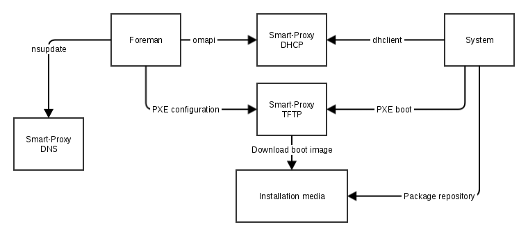

!SLIDE smbullets small noprint
# Provisioning using PXE

* Identifier is the mac address

~~~SECTION:notes~~~

* Additional communication to Foreman, Puppet and other systems depending on the PXE configuration/answer file

~~~ENDSECTION~~~

!SLIDE smbullets small printonly
# Provisioning using PXE

* Identifier is the mac address

~~~SECTION:handouts~~~

****

For the installation using PXE the identfier used is the mac address so it is required during configuration of
the host in Foreman. For communication with Foreman a token is created as identifier. 

~~~PAGEBREAK~~~

After the host is created in Foreman, it reserves an IP address in DHCP, creates DNS records and places a PXE 
configuration on the TFTP server. If not already existing the Smart Proxy TFTP downloads the boot image to its
directory.

When the host is started it gets its IP address using DHCP which also tells him to boot via PXE from the TFTP server.
The PXE configuration points also to the answer file provided by Foreman which will point to the configured
installation media for package installation.

Additional communication to Foreman, Puppet and other systems will be required depending on the PXE configuration
or answer file provided. Typically a system should register to all management systems and finish its installation 
by contacting Foreman.

When Foreman is told an installation is finished, it will clean up by changing the PXE configuration to local boot
and change other configurations only need during provisioning.

The Foreman manual provides some more detailed workflow diagrams: http://theforeman.org/manuals/1.10/index.html#4.4.6Workflow

~~~ENDSECTION~~~

!SLIDE smbullets small
# Lab ~~~SECTION:MAJOR~~~.~~~SECTION:MINOR~~~: Create a virtual machine "pxe"

* Objective:
 * Create a virtual machine "pxe" for PXE installation
* Steps:
 * Open "Virtual Machine Manager" application
 * Select "New virtual machine" from the menu or by pressing the button
 * Select PXE boot
 * Select "Linux" and "Red Hat Enterprise Linux 7.5" for CentOS or "Debian Stretch" for Debian according to your preferences
 * Keep the minimum requirements for RAM, CPU and Disk
 * Name your VM "pxe" and select the network "foreman"
 * Create the VM and immediately pause it so in the next lab the required configuration in Foreman can be created

~~~SECTION:notes~~~

* If a student did not pause the system, he has to add the NIC as Boot media and change the boot order, shutdown the machine
and start it up again later
* CentOS will require 1.5 GB at least
* If the environment is not avialable, assign it to "Default Organization" and "Default Location".

~~~ENDSECTION~~~

!SLIDE supplemental exercises
# Lab ~~~SECTION:MAJOR~~~.~~~SECTION:MINOR~~~: Create a virtual machine "pxe"

## Objective:

****

* Create a virtual machine "pxe" for PXE installation

## Steps:

****

* Open "Virtual Machine Manager" application
* Select "New virtual machine" from the menu or by pressing the button
* Select PXE boot
* Select "Linux" and "Red Hat Enterprise Linux 7.5" for CentOS or "Debian Stretch" for Debian according to your preferences
* Keep the minimum requirements for RAM, CPU and Disk
* Name your VM "pxe" and select the network "foreman"
* Create the VM and immediately pause it so in the next lab the required configuration in Foreman can be created

!SLIDE supplemental solutions
# Lab ~~~SECTION:MAJOR~~~.~~~SECTION:MINOR~~~: Create a virtual machine "pxe"

****

## Create a virtual machine "pxe" for PXE installation

****

### Open "Virtual Machine Manager" application

Open the "Virtual Machine Manager" application from the Gnome Application menu

### Select "New virtual machine" from the menu or by pressing the button

### Select PXE boot

In the first step of the wizard select the network boot

### Select "Linux" and "Red Hat Enterprise Linux 7.5" for CentOS or "Debian Stretch" for Debian according to your preferences

In the second step choose "Linux" as operating system type and accoding to your preferences as version "Red Hat Enterprise Linux 7.5"
for CentOS or "Debian Stretch" for Debian. For later labs you will also have to choose an operating system, deploy at least one of every kind.

### Keep the minimum requirements for RAM, CPU and Disk

In the third step stick with the minimum requirements for RAM and CPU because several system will be deployed.
CentOS installer will require at least 1.5 GB instead of the default.
In the forth step keep the disk as small as possible but it will not matter as long as it is thin provisioned.

### Name your virtual machine "pxe" and select the network "foreman"

Name the virtual machine "pxe" so you know which system was deployed in which lab. Select the network "foreman" instead of "default".

### Create the virtual machine and immediately pause it so in the next lab the required configuration in Foreman can be created

Finish the wizard and immediately pause it before the boot times out.

If you did not pause the system in time, you will have to add the NIC as Boot media and change the boot order on the details view of the virtual machine.
This change needs a shutdown of the VM, it applys only to the VM after powering it off. Shut down the System and start it up again later for the next lab.

!SLIDE smbullets small
# Lab ~~~SECTION:MAJOR~~~.~~~SECTION:MINOR~~~: Configure the system "pxe" in Foreman

* Objective:
 * Configure the system "pxe" in Foreman and start the installation
* Steps:
 * Open Foreman's host dialog using "Host > Create Host"
 * On the Host tab name it "pxe" and select the Environment, Puppet CA and Master
 * On the Operating system tab select the Architecture, Operating System, Media, Partition table and set a Root password.
 * On the Interface tab click edit to configure the interface with the MAC address, identifier "eth0", select Domain and Subnet and keep the suggested IP address.
 * Unpause the VM

~~~SECTION:handouts~~~

****

~~~PAGEBREAK~~~

In the Interface tab it is possible to add multiple interfaces and also virtual interfaces like VLAN tagged interfaces or aliases.
Only one can be assigned as the primary interface mapped to the DNS record and only one as provisioning interface for PXE configuration
or connecting for executing scripts during installation. This can be the same interface but does not have to be in cases you have a
dedicated installation network.

Instead of setting the root password for every host created, a default can be set by providing a password hash on "Administer > Settings"
in the Provisioning tab as Root password. This is an MD5 hash for being supported by every Linux distribution.

~~~ENDSECTION~~~

!SLIDE supplemental exercises
# Lab ~~~SECTION:MAJOR~~~.~~~SECTION:MINOR~~~: Configure the system "pxe" in Foreman

## Objective:

****

* Configure the system "pxe" in Foreman and start installation

## Steps:

****

* Open Foreman's host dialog using "Host > Create Host"
* On the Host tab name it "pxe" and select the Environment "production", Puppet CA "foreman.localdomain" and Puppet Master "foreman.localdomain"
* On the Operating system tab select the Architecture "x86_64", Operating System, Media, Partition table depending on your choice earlier and set a Root password of your choice
* On the Interface tab click edit to configure the interface with the MAC address of the system created before, identifier "eth0", select Domain "localdomain" and Subnet "foreman" and keep the suggested IP address
* Unpause the virtual machine

!SLIDE supplemental solutions
# Lab ~~~SECTION:MAJOR~~~.~~~SECTION:MINOR~~~: Configure the system "pxe" in Foreman

****

## Configure the system "pxe" in Foreman and start installation

****

### Open Foreman's host dialog using "Host > Create Host"

### On the Host tab name it "pxe" and select the Environment "production", Puppet CA "foreman.localdomain" and Puppet Master "foreman.localdomain"

If the environment is not avialable, assign it to "Default Organization" and "Default Location".

### On the Operating system tab select the Architecture "x86_64", Operating System, Media, Partition table depending on your choice earlier and set a Root password of your choice

Use "foreman1" if you have no preference for the root password.

### On the Interface tab click edit to configure the interface with the MAC address of the system created before, identifier "eth0", select Domain "localdomain" and Subnet "foreman" and keep the suggested IP address

On the Interface tab click edit to configure the interface with the MAC address of the system created before (which could be found on the Details
view on the NIC or if paused in the console), identifier "eth0", select Domain "localdomain" and Subnet "foreman" and keep the suggested IP address
which will be a random one free in the range of the subnet.

### Unpause the virtual machine

When you unpause the virtual machine it will get the suggested IP address and the boot media and will start the unattended installation.

!SLIDE smbullets small
# Hostgroups

* Grouping Hosts
 * Nested groups in a hierarchical way
* Adds defaults to hosts
 * Required options for provisioning
 * Options for configuration management
 * Options for compute resources
 * Parameters
* Allows to associate templates

~~~SECTION:handouts~~~

Hostgroups are used to group hosts, the groups can be organized in a hierarchical way by nesting them.

The Hostgroups allows to add defaults for all options required by Foreman for provisioning and depending on your environment also
for configuration management and compute resources. Additional parameters can be set.

Furthermore to providing defaults configured at the hostgroup "Provisioning templates" can be associated to change from the operating
system default.

~~~ENDSECTION~~~

