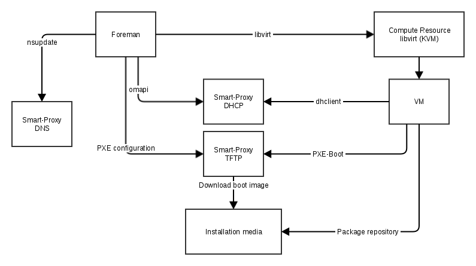

!SLIDE smbullets small noprint
# Provisioning using Compute resource libvirt

* Identifier is the name of the system

!SLIDE smbullets small printonly
# Provisioning using Compute resource libvirt

* Identifier is the name of the system

~~~SECTION:handouts~~~

****

For the installation using a Compute resource the identfier used is the name of the system.
A virtual machine will be created with the name and the mac address will be returned to use for PXE.
For communication with Foreman a token is created as identifier.

~~~PAGEBREAK~~~

After the host is created in Foreman, it creates the virtual machine, reserves an IP address in DHCP for the mac address returned,
creates DNS records and places a PXE configuration on the TFTP server. If not already existing the Smart Proxy TFTP downloads the
boot image to its directory.

Then the virtual machine is powered on and it works the same way like simple PXE installation.

~~~ENDSECTION~~~

!SLIDE smbullets small
# Lab ~~~SECTION:MAJOR~~~.~~~SECTION:MINOR~~~: Prepare Compute resource libvirt

* Objective:
 * Prepare Compute resource libvirt to install a virtual machine
* Steps:
 * Install the Compute resource using the Foreman installer
 * Create a passphraseless ssh-key for user foreman
 * Copy the public key to the root account of the host "host.localdomain"
 * Configure the Compute resource in Foreman Web GUI

~~~SECTION:handouts~~~

****

The Compute resource does not only provide the possibility to provision virtual machines, it also allows access to power management of
unmanaged systems and to deleted them from the virtualization platform. Also associating an unmanaged system to an already existing one
is possible.

~~~ENDSECTION~~~

!SLIDE supplemental exercises
# Lab ~~~SECTION:MAJOR~~~.~~~SECTION:MINOR~~~: Prepare Compute resource libvirt

## Objective:

****

* Prepare Compute resource libvirt

## Steps:

****

* Install the Compute resource using the Foreman installer
* Create a passphraseless ssh-key for user foreman using ssh-keygen
* Copy the public key to the root account of the host "host.localdomain" using ssh-copy-id
* Configure the Compute resource in Foreman Web GUI

!SLIDE supplemental solutions
# Lab ~~~SECTION:MAJOR~~~.~~~SECTION:MINOR~~~: Prepare Compute resource libvirt

****

## Prepare Compute resource libvirt to install a virtual machine

****

### Install the Compute resource using the Foreman installer

Execute the Foreman Installer with the following parameter to enable the Compute resource libvirt:

    # foreman-installer --enable-foreman-compute-libvirt

This will install the required packages and restart Foreman.

### Create a passphraseless ssh-key for user foreman using ssh-keygen

Switch to the user foreman and create an passphraseless ssh-key using ssh-keygen:

    # su - foreman -s /bin/bash
    $ ssh-keygen
    [ENTER]
    [ENTER]
    [ENTER]

### Copy the public key to the root account of the host "host.localdomain" using ssh-copy-id

If you know the password of the account in the remote system ssh-copy-id simplifies key management.

    $ ssh-copy-id root@host.localdomain

### Configure the Compute resource in Foreman Web GUI

Navigate to "Infrastructure > Compute resources" and click on "Create Compute Resource".

In the following dialog insert:

* Name: "host.localdomain"
* Provider: "Libvirt"
* URL: "qemu+ssh://root@host.localdomain/system"
* Display type: "VNC"
* Console password: unchecked

Validate your settings with "Test Connection" before clicking on "Submit".

!SLIDE smbullets small
# Lab ~~~SECTION:MAJOR~~~.~~~SECTION:MINOR~~~: Create the virtual machine "compute" from Foreman

* Objective:
 * Create the virtual machine "compute" from Foreman Web GUI and start an unattended installation
* Steps:
 * Open Foreman's host dialog using "Host > Create Host"
 * On the Host tab name it "compute" and select to deploy on the Compute resource
 * On the Virtual Machine tab change the Storage type to "QCOW2"
 * On the Operating system tab select the Architecture, Operating System, Media, Partition table and set a Root password.
 * On the Interface tab click edit to configure the interface with identifier "eth0", select Domain and Subnet and keep 
the suggested IP address, for the Libvirt options choose the virtual network "foreman".

~~~SECTION:handouts~~~

****

Compute resource options depend on the used Compute resource so other options will be available for VMware than for libvirt.

Defaults for the Compute resource options can be set using a Compute profile.

Storage type "QCOW2" enables you to use snapshots unlike "RAW".

~~~ENDSECTION~~~

!SLIDE supplemental exercises
# Lab ~~~SECTION:MAJOR~~~.~~~SECTION:MINOR~~~: Create the virtual machine "compute" from Foreman

## Objective:

****

* Create the virtual machine "compute" from Foreman Web GUI and start unattended installation

## Steps:

****

* Open Foreman's host dialog using "Host > Create Host"
* On the Host tab name it "compute" and select to deploy on the Compute resource
* On the Virtual Machine tab change the Storage type to "QCOW2"
* On the Operating system tab select the Architecture, Operating System, Media, Partition table and set a Root password.
* On the Interface tab click edit to configure the interface with identifier "eth0", select Domain and Subnet and keep the suggested IP address, for the Libvirt options choose the virtual network "foreman"

!SLIDE supplemental solutions
# Lab ~~~SECTION:MAJOR~~~.~~~SECTION:MINOR~~~: Create the virtual machine "compute" from Foreman

****

## Create the virtual machine "compute" from Foreman Web GUI and start unattended installation

****

### Open Foreman's host dialog using "Host > Create Host"

### On the Host tab name it "compute" and select to deploy on the Compute resource

For "Deploy on" use "host.localdomain (Libvirt)" instead of "Bare Metal" which will enable all the options of Compute resource
libvirt like the virtual network configuration or virtual hardware.

### On the Virtual Machine tab change the Storage type to "QCOW2"

### On the Operating system tab select the Architecture, Operating System, Media, Partition table and set a Root password.

### On the Interface tab click edit to configure the interface with identifier "eth0", select Domain and Subnet and keep the suggested IP address, for the Libvirt options choose the virtual network "foreman"

No Mac address is required this time, but do not forget to change the Libvirt options "Network type" to "Virtual (NAT)" and "Network"
to "foreman". 

Afterwards press "Submit" and Foreman will show the progress of virtual machine creation. Looking into "Virtual Machine Manager"
will show you the virtual machine created with fqdn.

!SLIDE smbullets small
# Compute profiles

* Used to provide defaults for virtual machine creation
* Default provides three for different sized VMs
* Same profile names could be used for different Compute resources
 * Different defaults for same type of systems based on virtualization platform
 * Only available to Compute resource if configured
* Available in "New Host" dialog

~~~SECTION:handouts~~~

****

Compute profiles are used to provide defaults for the virtual machine creation. Per default three profiles
are available and only have to be configured, but you can create as many as needed. The same profile can differ
based on the Compute resource used to provide defaults matching the virtualization platform.

~~~PAGEBREAK~~~

If one is configured for a Compute resource option to choose from it is available on new host dialog after choosing
the Compute resource to deploy on.

~~~ENDSECTION~~~

!SLIDE smbullets small
# Images

* Available to install from instead of unattended installation
* Image has to be configured
 * On Compute resource using "New image"
 * Has to provide access via ssh to run finish scripts
 * API can allow to run user_data scripts for additional changes
 * cloud_init can be installed to use the scripts of the same name
* Available in "Create host" dialog
 * Speeds up installation
 * Should be very basic image, but of course can be very featureful if required

~~~SECTION:handouts~~~

****

~~~PAGEBREAK~~~

Images are available as install source to all Compute resources, for some as the only source. To be available to Foreman
it has also to be configured using the "New image" dialog after selecting a Compute resource. The image has to be created
with an user which has shell access to run finish scripts and depending on the Compute resource also user_data scripts can run
during virtual machine creation to change settings. Another option are cloud_init scripts if you installed cloud_init at the system
and pointed it to Foreman.

If a image is configured it is possible to choose it from the "Create host" dialog on the "Operating system" tab. In some cases
it can speed up the installation process, but of course an unattended installation will give you a cleaner and more up to date
system. If using a configuration management a very basic image should be prefered, but if required a image can be very featureful
like having some proprietary software installed which is quite complicated to install with configuration management.

~~~ENDSECTION~~~

!SLIDE smbullets small
# Console

* Direct console access on virtual machines
* Javascript library noVNC
* Protocols: 
 * VNC
 * SPICE
 * VMRC (for VMware)
* Depending on Compute Resource provider
* Encryption and Authentication based on environment
* An alternative is the webconsole (part of Remote Execution)

~~~SECTION:handouts~~~

****

Foreman uses the javascript library noVNC to give the user direct access to the console
of a virtual machine depending on the Compute Resource provider. 
The Foreman manual explains additional steps required on the Compute Resource if not available by default.
The protocols available are VNC and SPICE, encryption and authentication depends on
your setup.

If you want to try it in the training environment you have to enable the connection by
executing the following command on the laptop.

    # iptables -I INPUT -p tcp -m multiport --dports 5901:6000 -i virbr1 -j ACCEPT

 

Furthermore Firefox will block the websocket connection unless you change setting 
network.websocket.allowInsecureFromHTTPS to true in about:config.

Another option is VMRC which is available for the Compute Resource VMware and provides a link to use
with the client for a direct access instead of the embedded option via noVNC.

Furthermore there is the option to use the Cockpit-based webconsole as part of the Remote Execution plugin.

~~~ENDSECTION~~~
