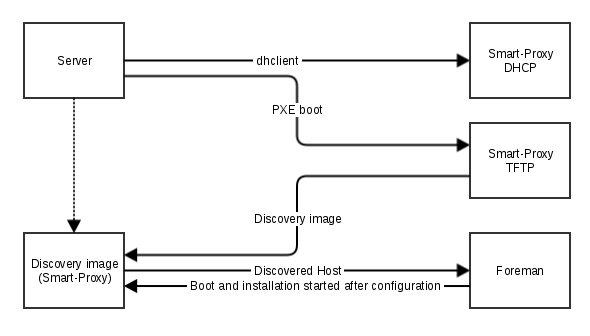

!SLIDE smbullets small noprint
# Provisioning using Discovery plugin

* Identifies itself as discovered host with its mac address

!SLIDE smbullets small printonly
# Provisioning using Discovery plugin

* Identifies itself as discovered host with its mac address

~~~SECTION:handouts~~~

****

For the installation the system boots a discovery image and identifies itself as "Discovered Host" in the Foreman Web GUI.
As an identifier the host uses its mac address. Then configuration is done in Foreman and after submitting it the image 
is told to reboot and starts an installation via PXE afterwards.

~~~PAGEBREAK~~~

For this communication the discovery image uses the Smart proxy included in it.

~~~ENDSECTION~~~

!SLIDE smbullets small
# Lab ~~~SECTION:MAJOR~~~.~~~SECTION:MINOR~~~: Install and configure the Discovery plugin

* Objective:
 * Install and configure the Discovery plugin
* Steps:
 * Run the Foreman installer to install the Discovery plugin and download the image
 * Adjust and deploy the PXE default configuration
 * Enable the discovery widget in the dashboard

!SLIDE supplemental exercises
# Lab ~~~SECTION:MAJOR~~~.~~~SECTION:MINOR~~~: Install and configure the Discovery plugin

## Objective:

****

* Install and configure the Discovery plugin

## Steps:

****

* Run the Foreman installer to install the Discovery plugin and download the image
* Adjust and deploy the PXE default configuration
* Enable the discovery widget in the dashboard

!SLIDE supplemental solutions
# Lab ~~~SECTION:MAJOR~~~.~~~SECTION:MINOR~~~: Install and configure the Discovery plugin

****

## Install and configure the Discovery plugin

****

### Run the Foreman installer to install the Discovery plugin and download the image

Add the parameters to enable the Discovery plugin and download the image to the Foreman installer

    # foreman-installer --enable-foreman-plugin-discovery --foreman-plugin-discovery-install-images=true
    # service httpd restart

### Adjust and deploy the PXE default configuration

Navigate to "Hosts > Provisioning Templates" and click on "Build PXE Default" to deploy the "PXELinux global default"
on the TFTP server which includes a snippet "pxelinux_discovery".

### Enable the discovery widget on the dashboard

Navigate to "Monitor > Dashboard" and select from "Manage > Add widgets" the "Discovery widget".

!SLIDE smbullets small
# Lab ~~~SECTION:MAJOR~~~.~~~SECTION:MINOR~~~: Create a virtual machine "discovery"

* Objective:
 * Create a virtual machine "discovery" for PXE installation
* Steps:
 * Open "Virtual Machine Manager" application
 * Select "New virtual machine" from the menu or by pressing the button
 * Select PXE boot
 * Select "Linux" and "Red Hat Enterprise Linux 7.2" for CentOS or "Debian jessie" for Debian according to your preferences
 * Keep the minimum requirements for RAM, CPU and Disk
 * Name your virtual machine "discovery" and select the network "foreman"
 * Create the virtual machine and when the PXE menu appears select "(discovery)"

!SLIDE supplemental exercises
# Lab ~~~SECTION:MAJOR~~~.~~~SECTION:MINOR~~~: Create a virtual machine "discovery"

## Objective:

****

* Create a virtual machine "discovery" for PXE installation

## Steps:

****

* Open "Virtual Machine Manager" application
* Select "New virtual machine" from the menu or by pressing the button
* Select PXE boot
* Select "Linux" and "Red Hat Enterprise Linux 7.2" for CentOS or "Debian jessie" for Debian according to your preferences
* Keep the minimum requirements for RAM, CPU and Disk
* Name your virtual machine "discovery" and select the network "foreman"
* Create the virtual machine and when the PXE menu appears select "(discovery)"

#### Expected result:

The Discovery images boots, reports status "SUCCESS" on the console and appears in the Foreman Web GUI in the "Discovery widget".

!SLIDE supplemental solutions
# Lab ~~~SECTION:MAJOR~~~.~~~SECTION:MINOR~~~: Create a virtual machine "discovery"

****

## Create a virtual machine "discovery" for PXE installation

****

### Open "Virtual Machine Manager" application

Open the "Virtual Machine Manager" application from the Gnome Application menu

### Select "New virtual machine" from the menu or by pressing the button

### Select PXE boot

In the first step of the wizard select the network boot

### Select "Linux" and "Red Hat Enterprise Linux 7.2" for CentOS or "Debian jessie" for Debian according to your preferences

In the second step choose "Linux" as operating system type and accoding to your preferences as version "Red Hat Enterprise Linux 7.2"
for CentOS or "Debian jessie" for Debian. For later labs you will also have to choose an operating system, deploy at least one of every kind.

### Keep the minimum requirements for RAM, CPU and Disk

In the third step stick with the minimum requirements for RAM and CPU because several system will be deployed.
In the forth step keep the disk as small as possible but it will not matter as long as it is thin provisioned.

### Name your virtual machine "discovery" and select the network "foreman"

Name the virtual machine "discovery" so you know which system was deployed in which lab. Select the network "foreman" instead of "default".

### Create the virtual machine and when the PXE menu appears select "(discovery)"

Finish the wizard and let it boot from the default PXE configuration when the PXE menu appears select "(discovery)" instead of "(default)".
The discovery image should boot now and report status "SUCCESS" on the console, then a system appears in the Foreman Web GUI in the "Discovery widget"
named after the mac address with prefix "mac".

!SLIDE smbullets small
# Lab ~~~SECTION:MAJOR~~~.~~~SECTION:MINOR~~~: Configure the system "discovery" in Foreman

* Objective:
 * Configure the system "discovery" in Foreman and start installation
* Steps:
 * Select the newly discoverd host from the widget
 * On the Host tab name it "discovery" and select the Environment, Puppet CA and Master
 * On the Interface tab click edit to configure the interface add the Domain "localdomain"
 * On the Operating system tab select the Architecture, Operating System, Media, Partition table and set a Root password
 * Submit to start the installation

!SLIDE supplemental exercises
# Lab ~~~SECTION:MAJOR~~~.~~~SECTION:MINOR~~~: Configure the system "discovery" in Foreman

## Objective:

****

* Configure the system "discovery" in Foreman and start installation

## Steps:

****

* Select the newly discoverd host form the widget
* On the Host tab name it "discovery" and select the Environment, Puppet CA and Master
* On the Interface tab click edit to configure the interface add the Domain "localdomain"
* On the Operating system tab select the Architecture, Operating System, Media, Partition table and set a Root password
* Submit to start the installation

!SLIDE supplemental solutions
# Lab ~~~SECTION:MAJOR~~~.~~~SECTION:MINOR~~~: Configure the system "discovery" in Foreman

****

## Configure the system "discovery" in Foreman and start installation

****

### Select the newly discoverd host from the widget

### On the Host tab name it "discovery" and select the Environment "production", Puppet CA "foreman.localdomain" and Puppet Master "foreman.localdomain"

### On the Interface tab click edit to configure the interface add the Domain "localdomain"

All other fields are already set to the facts provided by the Discovery image.

### On the Operating system tab select the Architecture "x86_64", Operating System, Media, Partition table depending on your choice earlier and set a Root password of your choice

### Submit to start the installation

!SLIDE smbullets small
# Discovery rules

* Automatic rule based installation
 * Located in "Configure > Discovery rules"
 * Match on facts provided by the discovery image
 * Naming based on template
 * Installation and configuration based on hostgroup
 * Provides a limit and a priority for ordering 
* Not enabled by default
 * Requires setting "discovery_auto" changed to "true"

~~~SECTION:handouts~~~

****

Discovery rules allow an automatic rule based installation. Depending on facts provided by the discovery image a rule is selected
and the system is installed based on the configuration of the selected hostgroup. Naming is done based on a template using ERB which
allows to use facts or random numbers, by default the macaddress is used. Setting a limit and a priority allows some ordering like
deploy first two backend systems of this size and then two frontend systems.

Usage of the rule based installation is not enabled by default but simple switched on by changing the setting "discovery_auto" to "true".

~~~ENDSECTION~~~

!SLIDE smbullets small
# Discovery image

* Provided by the project
 * Allows to add custom facts
 * Allows to add custom extensions like drivers
 * Could be remastered to provide defaults
 * Can use kexec to directly boot a new kernel

~~~SECTION:handouts~~~

****

The discovery image is provided by the project also with corresponding tools and documentation on extending and remastering it.

It also allows to add custom facts in its interface, as boot parameter or as an extension which enables a workflow like booting the image
and adding desired system type as fact.

Furthermore it could be used in enviroments without PXE and DHCP by providing all settings including an ip address and boot directly
into a new kernel with kexec. This is only available for Red Hat derivates at the moment.

~~~ENDSECTION~~~
