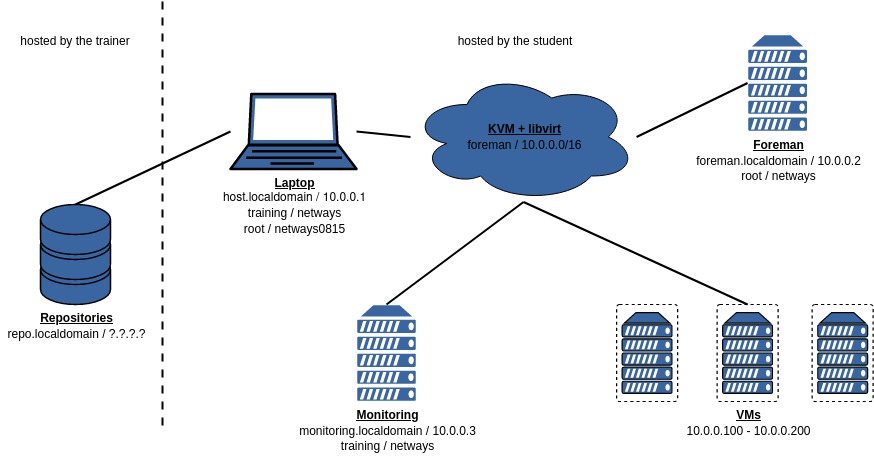

!SLIDE smbullets small noprint

# Training Environment

~~~SECTION:notes~~~

* Note on the flipchart the address of the repos you are hosting

~~~ENDSECTION~~~

!SLIDE smbullets small printonly

# Training Environment

~~~SECTION:handouts~~~

****

The laptop provided for the training is running CentOS 7 with Gnome 3 in Fallback mode.
You can login with the unprivileged user "training" and password "netways". 
The password for user "root" required for some exercises is also "netways".

For virtualization the laptop runs KVM with libvirt. A virtual network named "foreman"
is configured with the IP address "10.0.0.1" assigned to the laptop and a host entry 
"host.localdomain", the IP address "10.0.0.2" is assigned to an already existing VM
used to install Foreman.

~~~PAGEBREAK~~~

The virtual machine is named "foreman.localdomain" and allows login via SSH with user "root"
and password "netways". Foreman will be installed on it including DNS and DHCP service. 
This system also runs a LDAP service which will be required for some exercises.

A second virtual machine is named "monitoring.localdomain" and allows login via SSH with user "root"
and password "netways". Icinga 2, Icinga Web 2 and the Director are already prepared on it for the exercises.

Additional VMs will be deployed in the address range of "10.0.0.100" to "10.0.0.200" using
the repositories hosted by the trainer. He will give you information about the address to connect.
Please do _not_ use the upstream repositories, it will slow down the performance!

~~~ENDSECTION~~~

