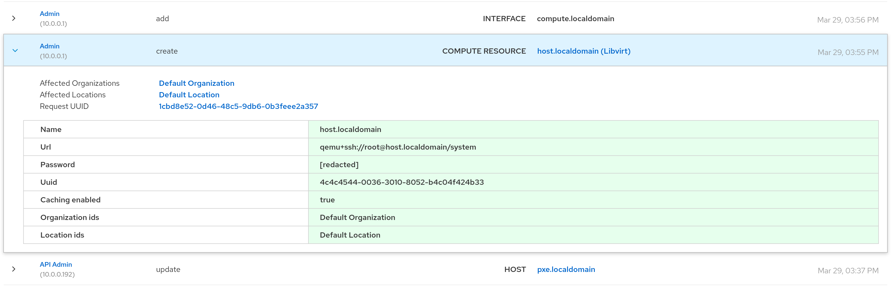

!SLIDE smbullets small
# Auditing

* Almost all changes from WebGUI and API
* User, timestamp, change and parent object
* For templates additional diff of the changes
* Browse and searchable in the WebGUI

~~~SECTION:handouts~~~

****

~~~PAGEBREAK~~~

Foreman logs almost all changes from the WebGUI and API including the user, a timestamp, the change and
the parent object like the host or a parameter got changed. For templates an additional diff of the changes
is provided.

All this auditing data are browse and searchable in the WebGUI via "Monitor > Audits". To get detailed
auditing data or specific change history simply select an entry.

~~~ENDSECTION~~~
