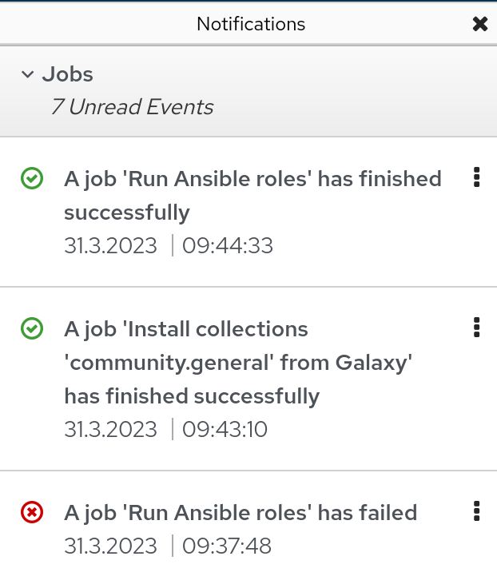
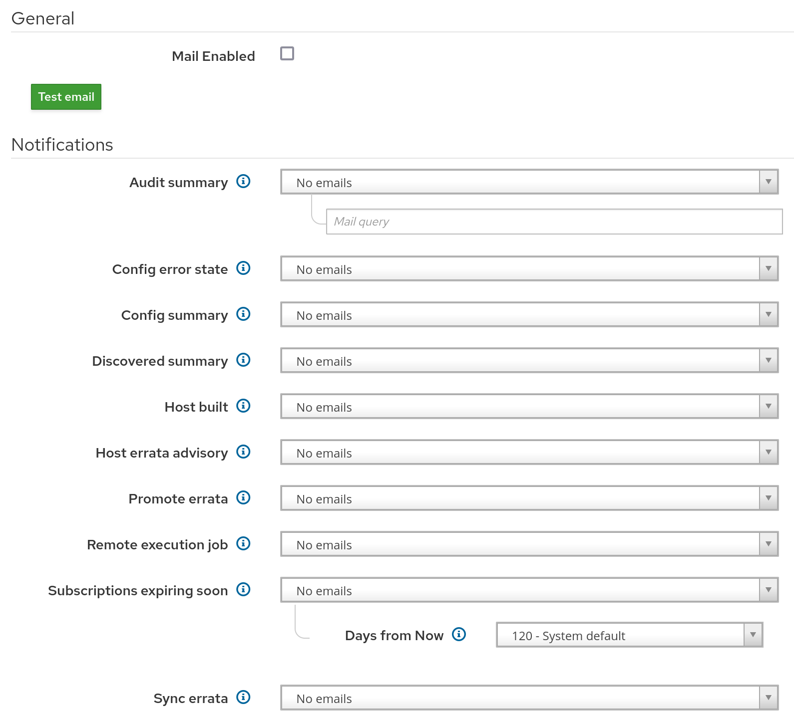

!SLIDE smbullets small
# Internal Notifications

* Notification for own actions
* Used by Foreman and many plugins
* Also integrates the Foreman RSS feed

~~~SECTION:handouts~~~

****

Foreman provides a new notification feature to notify about your own actions since 1.15 which is already used by Foreman and
many plugins. This allows to keep track of actions run independently.

Furthermore it integrates the Foreman RSS feed to keep the user updated, but also to provide some numbers to the Foreman Project.
You can simply opt-out via the setting "RSS enable" on the "Administer > Settings > Notification" tab.

~~~ENDSECTION~~~

!SLIDE smbullets small
# Email Notifications

* General configuration via Foreman Installer or configuration file 
* Optional setting by user

~~~SECTION:handouts~~~

****

Foreman can send email notifications to the user. This requires email settings configured in Foreman via the Foreman Installer
or manual editing of the configuration file "/etc/foreman/email.yaml". With this configuration in place a user can decide to
opt-in for several kinds of notification. Which options are available depends on installed plugins.

~~~ENDSECTION~~~
