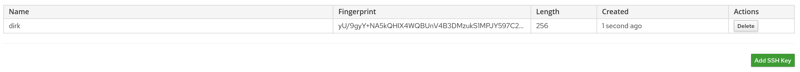

!SLIDE smbullets small
# SSH Key Management

* SSH Keys provided by Users
* New feature since 1.15
* Available as parameter on hosts owned
* Used in snippet "create_users" during provisioning

~~~SECTION:handouts~~~

****

Foreman provides a new notification feature allowing users to manage their own SSH keys since 1.15 which is made available as parameter on
hosts owned by the user or its groups. An example for usage during provisioning is provided in the snippet "create_users".

~~~ENDSECTION~~~
